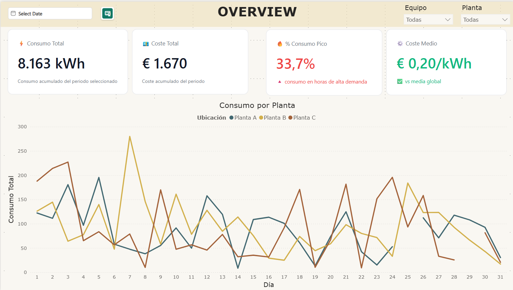
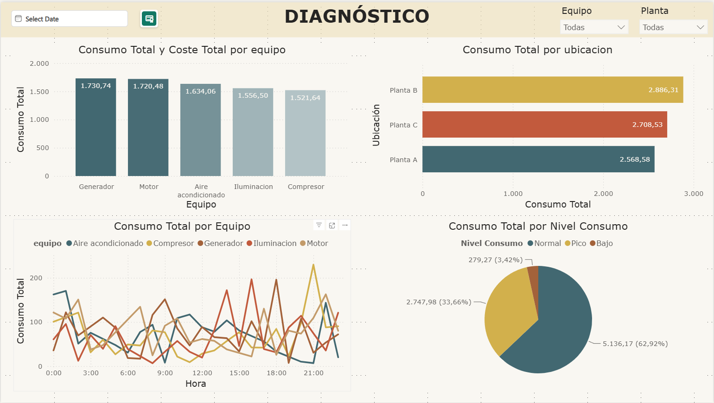
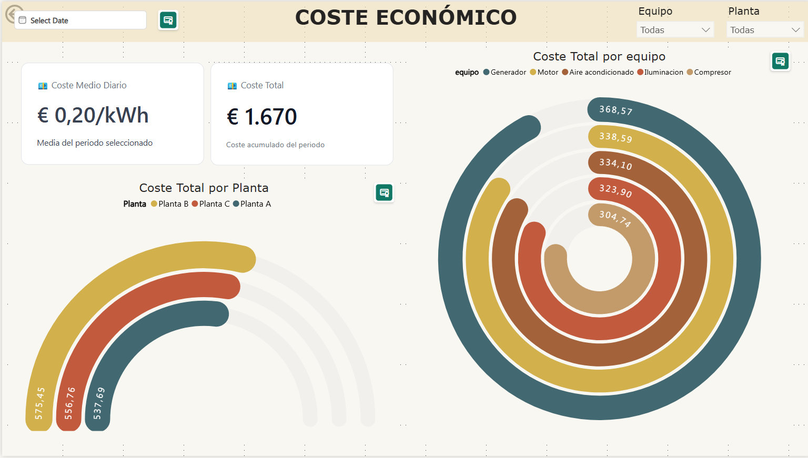
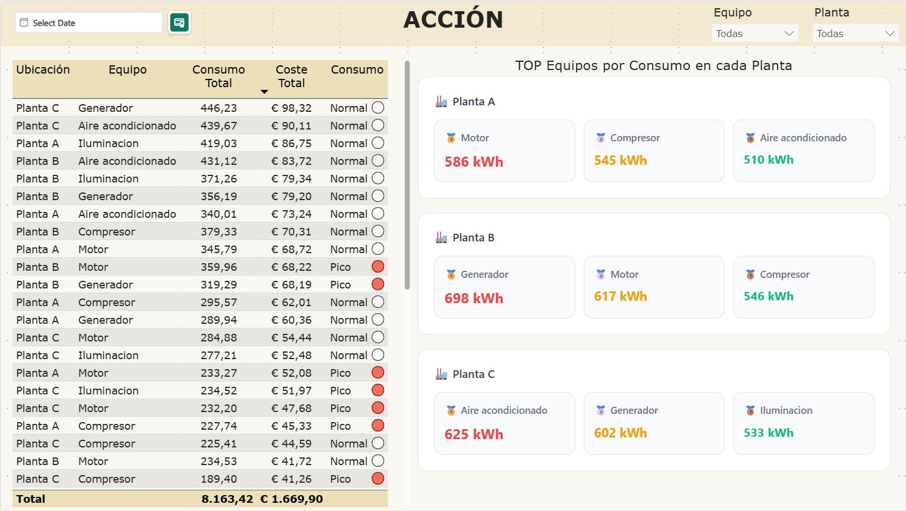

# Energy Consumption Analytics Dashboard

Power BI dashboard designed to analyze energy consumption across industrial plants, identify high-consumption equipment, detect peak demand patterns and support operational decision-making.

The goal of this project is not only to visualize energy data, but to answer a business question:

> Where is energy being consumed the most, and what actions can be taken to optimize it?

---

## Dashboard Preview



---

## Business Problem

Industrial plants often consume energy unevenly across locations, equipment and time periods. Without a clear analytical view, it becomes difficult to understand:

- where energy consumption is concentrated
- which equipment generates the highest cost
- when peak consumption occurs
- which operational actions should be prioritized

This lack of visibility can limit cost optimization and reduce operational efficiency.

---

## Project Objective

The objective of this dashboard is to provide a clear analytical tool for operations and facility teams, helping them move from general monitoring to actionable decisions.

The report is structured around three key questions:

1. What is happening?
2. Where is the problem?
3. What should be done next?

---

## Dataset

This project uses a simulated energy consumption dataset created for portfolio and learning purposes.

The dataset represents energy usage across different industrial plants and equipment over time. It was used to practice Power BI dashboard design, DAX measures, data modeling and business-oriented analytical storytelling.

Main fields include:

- Date
- Plant
- Equipment
- Energy consumption in kWh
- Cost
- Consumption level classification

---

## Target Users

This dashboard is designed for:

- Operations managers
- Facility managers
- Industrial leadership teams
- Business intelligence users working with operational data

The main purpose is to help users understand the situation quickly and make data-driven decisions.

---

## Business Impact

This dashboard helps transform raw energy consumption data into operational insights.

Potential business value:

- Identify plants with higher energy consumption
- Detect equipment responsible for major consumption and cost
- Monitor the percentage of consumption occurring during peak hours
- Support decisions around equipment scheduling and energy optimization
- Prioritize actions based on plant and equipment-level performance

Instead of showing isolated charts, the report follows a decision-making flow:

> Overview → Diagnosis → Action

This makes the dashboard useful not only for reporting, but also for operational improvement.

---

## Dashboard Structure

The report is designed as an analytical application with three main levels.

---

### 1. Overview

Purpose: understand the overall situation in seconds.

Key KPIs:

- Total Consumption
- Total Cost
- Average Cost per kWh
- Percentage of Peak Consumption

This page answers:

> What is happening?


---

### 2. Diagnosis

Purpose: identify the causes behind consumption patterns.

Analysis by:

- Plant
- Equipment
- Hour
- Consumption level

This page helps detect:

- consumption patterns
- peak demand periods
- uneven distribution across plants
- critical equipment

This page answers:

> Where is the problem?



---

### 3. Economic Cost Analysis

Purpose: understand the cost impact of energy consumption.

This page includes:

- Total cost by equipment
- Total cost by plant
- Average cost per kWh
- Accumulated cost for the selected period



---

### 4. Action

Purpose: support decision-making.

This page includes:

- Detailed table by plant and equipment
- Consumption and cost values
- Consumption level classification
- Top 3 equipment by plant

This page answers:

> What should be done next?



---

## Key Insights

The analysis highlights several relevant findings:

- A significant share of energy consumption occurs during peak hours.
- Consumption is not evenly distributed across plants.
- Some equipment categories concentrate a larger share of total consumption.
- The issue is localized, not global, which allows more focused optimization actions.

---

## Data Model

The project uses a simplified star schema designed for clarity, performance and scalability.

### Fact Table

`Fact_Consumo`

Main fields:

- Date
- Plant
- Equipment
- Consumption_kWh
- Cost
- Consumption Level

### Dimension Tables

`Dim_Fecha`

- Date
- Day
- Month
- Year

`Dim_Planta`

- Plant

`Dim_Equipo`

- Equipment

### Relationships

- Fact_Consumo → Dim_Fecha
- Fact_Consumo → Dim_Planta
- Fact_Consumo → Dim_Equipo

The model uses one-to-many relationships from dimensions to the fact table and keeps the structure clean and easy to maintain.

---

## DAX Measures

Main measures used in the report:

```DAX
Total Consumption =
SUM(Fact_Consumo[Consumption_kWh])
Total Cost =
SUM(Fact_Consumo[Cost])
Average Cost =
DIVIDE(
    [Total Cost],
    [Total Consumption]
)
Peak Consumption % =
DIVIDE(
    CALCULATE(
        [Total Consumption],
        Fact_Consumo[Consumption Level] = "Peak"
    ),
    [Total Consumption]
)
Consumption Level =
VAR EquipmentAverage =
    CALCULATE(
        AVERAGE(Fact_Consumo[Consumption_kWh]),
        ALLEXCEPT(
            Fact_Consumo,
            Fact_Consumo[Equipment]
        )
    )
RETURN
    SWITCH(
        TRUE(),
        Fact_Consumo[Consumption_kWh] > EquipmentAverage, "Peak",
        Fact_Consumo[Consumption_kWh] < EquipmentAverage * 0.5, "Low",
        "Normal"
    )

This logic compares each equipment value against its own context instead of using arbitrary fixed thresholds.

---

## Analytical Concepts Applied

This project focuses on analytical thinking, not only dashboard design.

Main concepts applied:

- Filter context in DAX
- Difference between totals and averages
- Dynamic segmentation by plant, equipment and date
- Context-aware classification
- Use of `CALCULATE` to modify evaluation context
- Use of `ALLEXCEPT` to preserve the relevant grouping context

---

## Design Decisions

The dashboard was designed with a clear principle:

> Prioritize decision-making over decoration.

Main design decisions:

- Clean grid-based layout
- Maximum of 5-6 visuals per page
- Consistent visual hierarchy
- KPI cards with contextual information
- Semantic use of color
- Custom KPI components using HTML
- Clear navigation between analytical layers

The objective was to reduce cognitive load and make the dashboard understandable in less than 10 seconds.

---

## Tools Used

- Power BI
- DAX
- Power Query
- HTML custom visuals
- Star schema data modeling

---

## Recommended Actions

Based on the analysis, the dashboard supports the following actions:

- Review energy consumption during peak hours
- Reschedule high-consumption equipment when possible
- Prioritize optimization efforts on the most intensive equipment
- Monitor plants with consistently higher energy consumption
- Use plant and equipment-level insights to guide operational decisions

---

## Future Improvements

Possible future improvements:

- Add previous period comparison
- Add monthly variation metrics
- Include expected cost vs actual cost
- Add automatic alerts for abnormal consumption
- Add dynamic insight cards
- Include energy price scenarios

Example future DAX measure:

```DAX
Previous Period Consumption =
CALCULATE(
    [Total Consumption],
    DATEADD(Dim_Fecha[Date], -1, MONTH)
)
Consumption Variation % =
DIVIDE(
    [Total Consumption] - [Previous Period Consumption],
    [Previous Period Consumption]
)
## Project Outcome

This project demonstrates how Power BI can be used to build a business-oriented analytical tool.

The value of the dashboard is not only in the visuals, but in the way the data is modeled, analyzed and communicated.

Final result:

- Clear business problem
- Structured analytical flow
- Clean data model
- Relevant DAX measures
- Actionable insights
- Decision-oriented dashboard design
